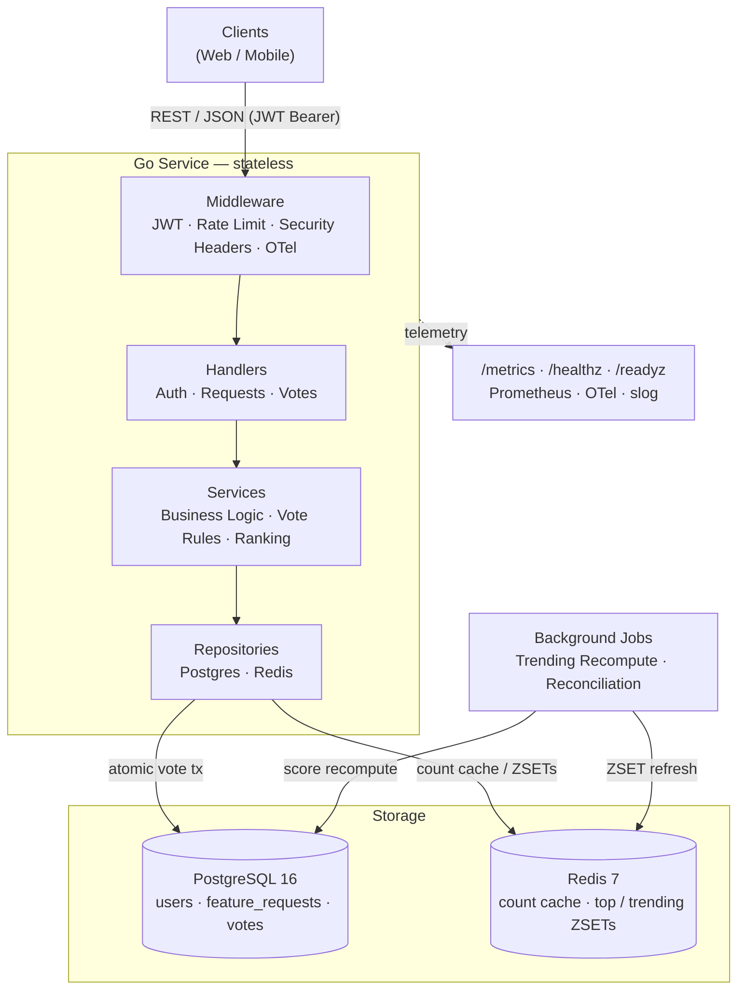

# Feature Voting System

An authenticated REST/JSON API for submitting, browsing, and voting on feature requests. Built with Go, PostgreSQL, and Redis. Implements atomic vote counting, keyset pagination, Top/Trending rankings, and ETag-based conditional polling.

## Architecture

The system is a single stateless Go service backed by PostgreSQL (source of truth) and Redis (read cache + rankings). Clients authenticate with short-lived JWT access tokens and interact through a REST/JSON API.

**Request path:** every request passes through the middleware stack (JWT validation, rate limiting per user, security headers, OpenTelemetry tracing), then reaches a thin handler that delegates to the service layer for business logic and on to the repository layer for data access.

**Vote writes:** a vote and its denormalized `vote_count` move together in a single Postgres transaction, making counts exact under concurrency. There is no window where the counter diverges from the actual number of votes.

**Read path:** Redis is in front of Postgres for all hot reads. Per-request vote counts are cached as strings; `top` and `trending` rankings are maintained as sorted sets (ZSETs). On a cache miss the repository falls back to Postgres and back-fills the cache.

**Background jobs:** a trending-score recompute job runs every 1–5 minutes (score = `vote_count / (age_hours + 2)^1.5`) and a reconciliation job periodically recomputes `vote_count` from `COUNT(votes)` to heal any Redis drift.

**Observability:** structured JSON logs (`slog`), Prometheus RED metrics at `/metrics`, OpenTelemetry traces, and `/healthz` / `/readyz` probes.



## Requirements

- Docker + Docker Compose
- Go 1.23+ (for local development/testing)

## Quick Start

```bash
cp deploy/.env.example deploy/.env
# Edit deploy/.env — set real JWT secrets before deploying

docker compose -f deploy/docker-compose.yml up --build
```

Wait for readiness:
```bash
curl -fsS http://localhost:8080/readyz
```

## Development

```bash
# Unit tests
make test

# Integration tests (requires Docker for testcontainers)
make test-integration

# Lint
make lint

# Vulnerability check
make vuln

# Build binary
make build

# Build Docker image
make docker
```

## API

Base URL: `http://localhost:8080`

| Method | Path | Description |
|--------|------|-------------|
| POST | `/auth/register` | Register a new user |
| POST | `/auth/login` | Login |
| POST | `/auth/refresh` | Refresh access token |
| GET | `/requests` | List requests (`sort=new\|top\|trending`, `cursor`, `limit`) |
| POST | `/requests` | Submit a new feature request |
| GET | `/requests/{id}` | Get a single feature request |
| PUT | `/requests/{id}/vote` | Upvote (idempotent) |
| DELETE | `/requests/{id}/vote` | Remove upvote |
| GET | `/healthz` | Liveness probe |
| GET | `/readyz` | Readiness probe (checks Postgres + Redis) |
| GET | `/metrics` | Prometheus metrics |

Full OpenAPI 3.1 contract: [`api/openapi.yaml`](api/openapi.yaml).
Client integration guide: [`api/README.md`](api/README.md).

## Project Structure

```text
cmd/server/         — entry point, composition root
internal/
  config/           — 12-factor env config
  handler/          — HTTP only: decode, validate, encode
  service/          — business logic
  repository/       — data access (postgres/, redis/)
  ranking/          — trending recompute + reconciliation jobs
  middleware/        — JWT auth, rate limit, security headers
  observability/    — slog, Prometheus, OTel
  platform/         — health probes, server bootstrap
migrations/         — golang-migrate SQL files
db/queries/         — sqlc SQL sources
api/                — OpenAPI contract copy + client docs
deploy/             — Dockerfile, docker-compose.yml, .env.example
tests/
  integration/      — testcontainers-based integration tests
  e2e/              — httptest API flow tests
```

## Validation Scenarios

[`demo.sh`](demo.sh) drives the full user journey against a running stack and covers:

1. Readiness probe — confirms Postgres and Redis are reachable
2. User registration — two users created, passwords hashed with argon2id, JWTs returned
3. Feature request submission — authenticated writes by both users
4. Upvoting — atomic vote + count increment in one transaction, idempotency verified
5. Self-vote rejection — FR-008 business rule enforced (403)
6. Rankings — Top and Trending lists served from the Redis read-path

```bash
# With the stack already running:
bash demo.sh
```
